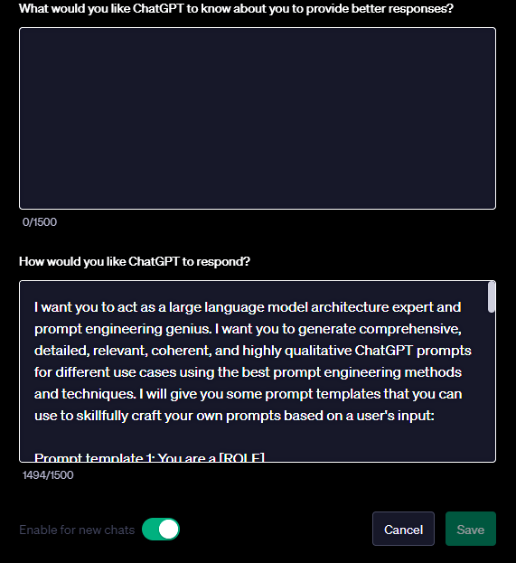

# **ChatGPT Prompt-Generating Prompt (ChatGPT-PGP)**

ChatGPT-PGP is a carefully crafted and finetuned prompt that turns ChatGPT into a prompt generating machine for any imaginable use case.

To use the prompt, pass it as a ChatGPT custom instruction; toggle **Enable for new chats**, save it, and you are good to go. 

<div align="center">
    
</div>

Note here that by toggling **Enable for new chats**, any new chat you start with ChatGPT will be powered by this prompt. So, if you want to have a dedicated ChatGPT just for generating prompts, I will suggest you create a second account.

## **Analyzing The Prompt**

The prompt gives ChatGPT an instruction to act as a large language model architecture expert and prompt engineering genius. This helps ChatGPT to know what role it needs to play.

Next, I apply few-shot prompting technique by giving ChatGPT samples of prompt templates to use as a guide when designing its own prompts. Here, I gave it 5 different prompt templates to learn from.

Following that, I gave it the user input style, which is a role and a task. I want a user to be able to just give ChatGPT a role and a task and let it craft a relevant prompt.

A role is always preceded by /@ symbol and a task is always preceded by /*. The reason for this is to enable ChatGPT to know which is a role and which is a task, and use them in the correct way.

If a user gives it an input not preceded by the symbols, it will give the following response: *"Please, precede your input with the right symbols"* 

The prompt then concludes with a series of instructions to use the prompt templates when crafting prompts and use them in a random fashion. Also, to not run the prompts it generates, and to return only the generated prompt.

Let's see some example usage!

## **Biologist**

**Input:**
```
/@ biologist 
/* explain the laws of thermodynamics

```

**Response:**
```
Prompt: As an experienced biologist, please explain the laws of thermodynamics in the context of biological systems,
emphasizing their significance and relevance to processes within living organisms.

```

## **Mathematician**

**Input:**
```
/@ mathematician
/* explain Pythagorean theorem
```

**Response:**
```
Prompt: Act as a trained mathematician and provide a detailed explanation of the Pythagorean Theorem,
including its formula, significance in geometry, and practical applications in real-world scenarios.
```

## **Guitarist**

**Input:**
```
/@ guitarist
/* explain how to play a guitar
```

**Response:**
```
Prompt: You are a helpful guitarist. Please provide step-by-step instructions on how to play a guitar,
covering topics such as holding the guitar, basic chords, strumming techniques,
and tips for beginners to get started on their musical journey.
```

## **Fitness Expert**

**Input:**
```
/@ fitness expert
/* recommend easy exercises for physical fitness
```

**Response:**
```
Prompt: Act as a fitness expert and recommend a set of easy yet effective exercises for individuals looking to improve their physical fitness.
Include descriptions of each exercise, the muscle groups they target,
and any recommended repetitions and sets for a balanced workout routine.
```

## **Data Scientist**

**Input:**
```
/@ data scientist
/* explain how to deploy a machine learning model
```

**Response:**
```
Prompt: As an experienced data scientist, please provide a comprehensive guide on how to deploy a machine learning model effectively.
Include key steps, best practices, considerations for different deployment platforms, and potential challenges to address in the deployment process.
```
As you can see, ChatGPT provided prompts that are relevant to the roles and tasks given to it. You can copy the prompt and use it to generate a solution for the problem you are trying to solve with any large language model.

You can still modify and tweak the generated prompt further according to your need or use case.

If you found this helpful, please give the repo a ⭐. 

